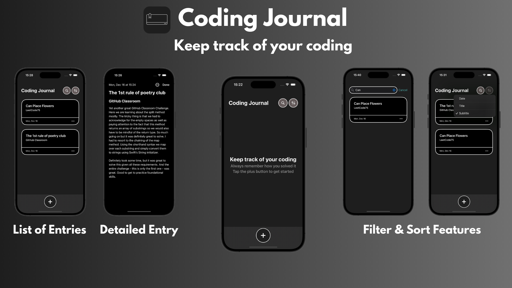
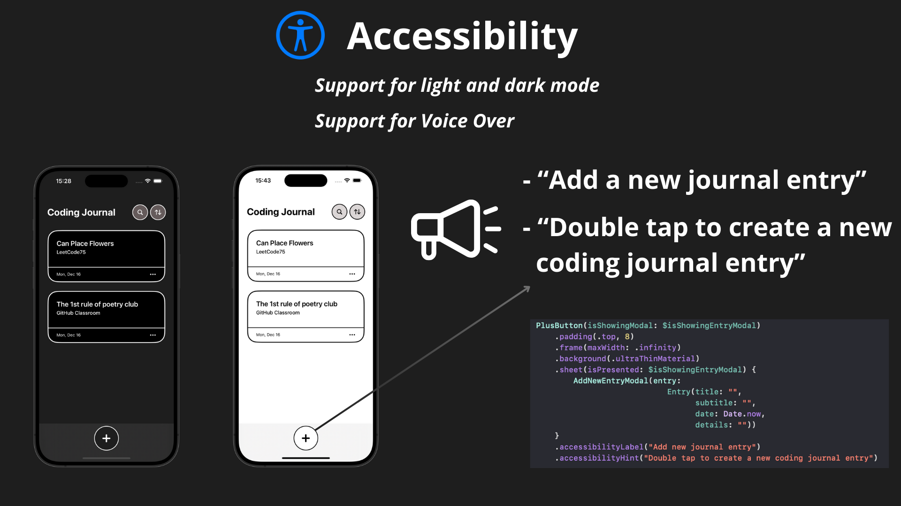

# Coding Journal




## Description
Coding Journal is a SwiftUI application that helps developers track their coding journey, solutions, and learning experiences. Built with SwiftData, it provides an intuitive interface for creating, managing, and searching through coding-related journal entries.

## Features
- **Journal Entries**: Create and edit detailed entries about your coding experiences, solutions, and learnings
- **Rich Text Support**: Write entries with titles, subtitles, and detailed content
- **Search Functionality**: Quickly find specific entries using the search feature
- **Sort Options**: Organize entries by date, title, or subtitle
- **Modern UI**: Clean, intuitive interface inspired by Apple's Journal app and DayOne
- **Light & Dark Mode**: Full support for system appearance settings
- **Accessibility**: VoiceOver support for visually impaired users
- **Empty State Handling**: Empty State View when there is no input

## Technologies Used
- **SwiftUI**
- **SwiftData**
- **Git & GitHub**
- **Xcode**

## What I'm Most Proud Of
- **Successfully Implementing SwiftData with sort and filter features**: Leveraged Apple's newest data persistence framework to manage journal entries efficiently

```swift
import SwiftUI
import SwiftData

struct CardEntriesListingView: View {
    @State private var isShowingDetailedViewModal = false
    @State private var selectedEntry: Entry?
    @Query(sort: [
        SortDescriptor(\Entry.date, order: .reverse),
        SortDescriptor(\Entry.title),
        SortDescriptor(\Entry.subtitle)])
    var entries: [Entry]
    
    var body: some View {
        if entries.isEmpty {
            EmptyStateView()
        } else {
            ScrollView {
                VStack {
                    ForEach(entries) { entry in
                        CardView(entry: entry)
                            .onTapGesture {
                                selectedEntry = entry
                                isShowingDetailedViewModal = true
                            }
                            .padding([.horizontal, .vertical], 8)
                            .accessibilityElement(children: .combine)
                            .accessibilityLabel("Journal entry: \(entry.title)")
                            .accessibilityHint("Double tap to view full entry")
                        
                    }
                    .fullScreenCover(item: $selectedEntry) { entry in
                        DetailedEntryView(entry: entry)
                    }
                }
            }
            .ignoresSafeArea(.container, edges: .bottom)
            .padding(.bottom, 78)
        }
    }
    
    init(sort: SortDescriptor<Entry>, searchString: String) {
        _entries = Query(filter: #Predicate {
            if searchString.isEmpty {
                return true
            } else {
                return $0.title.localizedStandardContains(searchString)
            }
        }, sort: [sort])
    }
}

#Preview {
    CardEntriesListingView(sort: SortDescriptor(\Entry.date, order: .reverse), searchString: "")
}
```
- **Learning Git & GitHub**: Learned the basics of Git & GitHub using the terminal and discovered some advanced commands like rebase or reflog
- **Supporting Light & Dark Mode**: Implemented a cohesive visual experience across appearance settings
- **Design Implementation**: Created a clean, intuitive interface by drawing inspiration from Apple's Journal app and DayOne while maintaining a unique identity
- **Accessibility Implementation**: Added basic VoiceOver support to make the app accessible to visually impaired users

## Design Inspiration
The app's design draws inspiration from two popular journaling applications:
- **Apple's Journal**: Main interface design and card-based entry listing
- **DayOne**: Modal navigation pattern for entry management

## Accessibility Features
- VoiceOver support 
- Semantic grouping of related content
- Clear accessibility labels and hints
- Support for dynamic type
- Intuitive navigation between journal entries
- Accessible search and sort functionality

## Requirements
- iOS 17.0 or later
- Xcode 15.0 or later
- Swift 5.9 or later

## Credits


- I took Colt Steele's [The Git & GitHub Bootcamp](https://www.udemy.com/course/git-and-github-bootcamp/learn/lecture/24507864?start=195#content) course on Udemy (absolutely loved it!).

## Author
- [alcode111](https://github.com/alcode111)
